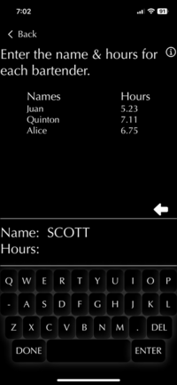

# OVERVIEW of the Tip Out App
## This app was featured on the Apple App Store
### This app makes it easy for the closing bartender to create a Tip Out Report for the whole bar team.

**Basics**
Tip Out has a minimalist, sleek aesthetic presented in Dark Mode. Tip Out is intuitive and most of the prompts are self-explanatory. I did not like the standard iOS keyboard for Tip Out, so I built a custom keyboard and number pad that only features unable characters and fits the visual theme of the app.

**How to Use:**

1. Hit Start to begin.

2. Selection your position. This app is meant for bartenders or waiters. 

3. If you worked with barback, tap Yes, otherwise tap No.

4. What percentage of the tips does your bar allocate for the barbacks? 

5. Enter the amount of tips the entire bar team pooled together.

6. Enter the name and hours of each bartender.

7. Enter the name and hours of each barback.

8. Review the Tip Out Report to know how much everyone is paid. You can review it and go back to make edits and if you want you can screenshot the report to text to everyone in the team. The Tip Out Report is scrollable so it doesn't matter how many bartenders and barbacks you include.

